# 👨🏻‍💻 Use case: Business Automation   

## Table of Contents
- [Architecture](#-architecture)
- [Use Case Description](#use-case-description)
- [Pre-requisites](#pre-requisites)
- [Create a watsonx.ai Agent](#create-a-watsonxai-agent)
  - [Comparison Agent](#comparison-agent)
    - [Setup](#setup)
    - [Configuration](#configuration)
    - [Tools](#tools)
    - [Saving and Deploying](#saving-and-deploying)
- [Integrating watsonx.ai agent as an External Agent in watsonx Orchestrate](#integrating-watsonxai-agent-as-an-external-agent-in-watsonx-orchestrate)
- [Create an Orchestrate Agent](#create-an-orchestrate-agent)
  - [Product Agent](#product-agent)
- [Experience Agents in Action](#experience-agents-in-action)


## 🏛 Architecture  


## Use Case Description

The sales department of ABC Motor Corp, an automotive large player, when preparing sales proposals, they were spending a lot of time understanding the features of competing products and comparing them with their own products. ABC Motor Corp, needs an automated competitive analysis system to help their sales teams quickly identify and position their products against competitors. Traditionally, gathering competitor insights required extensive manual research, making it inefficient and prone to outdated information. Therefore, the goal of this use case is to create an AI enabled system that support the customer's competitive analysis and market research.

## Pre-requisites

**Instructors**: 
- Check the corresponding [Instructor's guide](https://github.ibm.com/skol/agentic-ai-client-bootcamp-instructors/tree/main/usecase-setup/business-automation) to set up all environments and backend services.
  > NOTE: the `main` branch contains the latest release code. If you want to use a previous release, download the same [release](https://github.ibm.com/skol/agentic-ai-client-bootcamp-instructors/releases) that will be used for participants' lab. 
- Provide access to the data file located in the instructor repo at `usecase-setup/business-automation/assets/ABC_Motor_Product_Catalog.pdf` that will be uploaded as knowledge.

**Participants**:
- Validate that you have access to the right TechZone environment for this lab.
- Complete the [environment-setup](../../environment-setup) guide for steps on API key creation and project setup.
- Make sure you have created a [**watsonx** project](../../environment-setup/create-project.md) and a [Deployment Space](https://www.ibm.com/docs/en/watsonx/saas?topic=spaces-creating-deployment) in your **watsonx** project. 
- Validate that you have access to a credentials file that your instructor will share with you before starting the labs.
- Familiarity with AI agent concepts (e.g., instructions, tools, collaborators...)
- Make sure that your instructor has provided the following:
  - data file to be uploaded as knowledge

## Create a watsonx.ai Agent

We will create a **Comparison Agent** in watsonx.ai's **Agent Lab** as part of this setup:  

From the Home page of **Agent Lab**, click on **Build an AI agent to automate tasks**

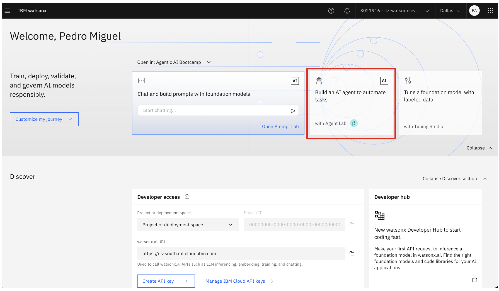 

Let's start the **Comparison Agent**. 

### Comparison Agent  
#### Setup  
1. **Name**: `Comparison Agent`
2. **Description**: 
   ```
   The agent compares the given data with additional information gathered from Google search results.
   ```
  

#### Configuration    
1. Choose **LangGraph** as the framework.  
2. Select **ReAct** as the architecture. 
3. Enter the following for **Instructions**. These instructions guide your agent on what tasks it should perform:
   ```
   You only refer from Automobile domain. You are an expert of automobile industry combining given details present in your context window.  Your task is crawl and search the Top 3 product URLs (strictly from the automobile industry) and to analyse and compare products on the following features strictly: Range, Pricing, Acceleration, Top Speed, Interior and Safety Features If a feature is not applicable, mark it as N/A. Additionally, perform a SWOT analysis of top products (Strengths, Weaknesses, Opportunities, and Threats) Present the comparison in 3 tables one for the comparison , second for the rating numerical rating (X/5) and a star rating (★ out of ★★★★★) for each feature  and  third for the SWOT analysis. Give heading to each table . After every table give two divider.
   Instructions:
   1. When asked for competitors of the given product, make sure that you provide only the name of the products and URLs of the products below the corresponding name.
   2. The generated product URLs must be strictly from the automobile industry.
   3. Title for Table 1: Feature Comparison
   4. Title for Table 2: Rating Comparison
   5. Make sure that the Rating Comparison table has both the numerical(X/5) and star rating(★ out of ★★★★★)
   6. The products should be the column names in all the tables.
   7. The font of the Table Title must be bold and the font size must be 40% bigger as compared to the rest of the text.
   8. Add appropriate space between each section in the table.
   9. Name the References as Competitors
   ```
  


> **Note:** The Google Search Tool is added by default to the Agent. However, if you accidentally click the delete icon, follow the Tool steps below. Otherwise, you can skip this.

#### Tools  

1. Click on the **Add Tool**.


2. Select **Google Search** as the tool to gather data.  
  

#### Saving and Deploying
Once the agent is created, save and deploy:

1. Click on the Disk icon (marked as 1), then to **Save As**
 
1. Select **Agent** and click **Save**

1. Click on the **Deploy** button
1. On the **Deploy as an AI service** page, you will be prompted to create a user api key. This will be used by **watsonx** to deploy your agent and is different from the **Cloud API key** created earlier. Click on **Create**. 

1. You'll be directed to another webpage. Click on **Create a key**.

1. Once a key is created, navigate back to **Deploy as an AI service** page. Click on **Reload**.

1. Make sure your **Targeted deployment space** (created previously when **watsonx** project was created) has been selected (marked as 1), click **Deploy** to deploy the agent (marked as 2)
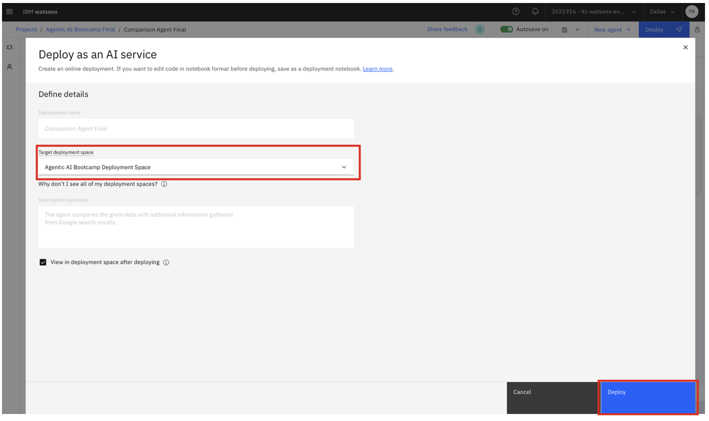

> **YOU DID IT! you just created and deployed your first AI Agent.**
> Now let's build more agents and integrate them together.

## Integrating watsonx.ai agent as an External Agent in watsonx Orchestrate

To deploy your agent on Orchestrate, follow the steps below: 

1. Go to the homepage of watsonx.ai Agent Lab.


2. Click on the hamburger menu and select **Deployments**.  


3. Click on the **Spaces** tab and select the space where you deployed the agent.  
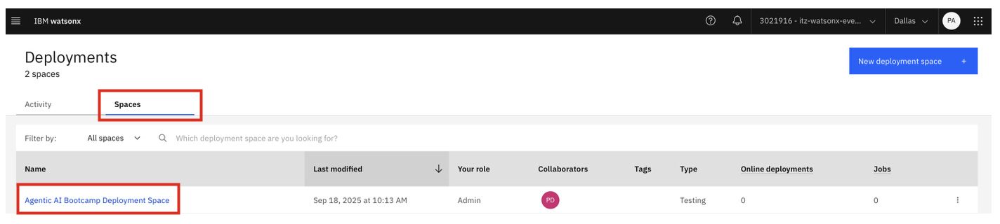

4. Click on the **Assets** tab and select the agent.  
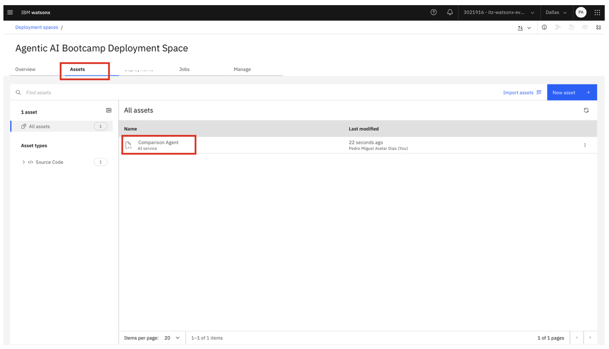

5. Then you will go the the main deployment page select your agent from the list.
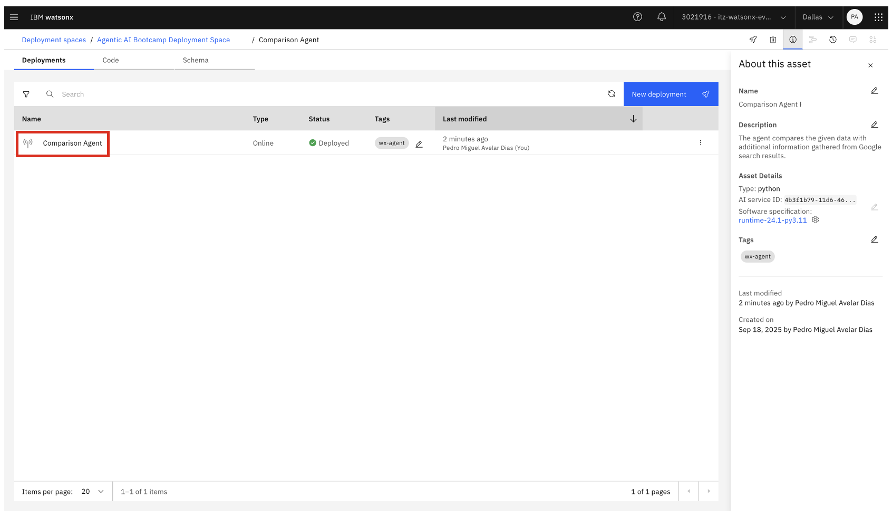

6. Then copy the streaming **Public endpoint**.
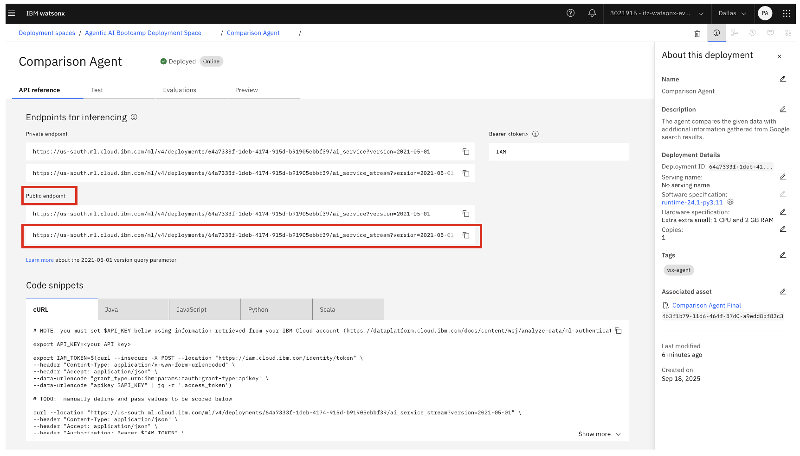

Now let's go to Orchestrate, create other agent and import this agent in that one.

## Create an Orchestrate Agent

In Orchestrate, we will create our main agent, as outlined below:

### Product Agent

>**Note:** Before starting the Agent creation, ensure you have generated an [IBM Cloud API key](https://github.ibm.com/skol/agentic-ai-client-bootcamp/blob/main/environment-setup/api_key_setup.md). 

1. Go to the Orchestrate home page, click on the hamburger menu (☰), select **Build**, and then choose **Agent Builder**.
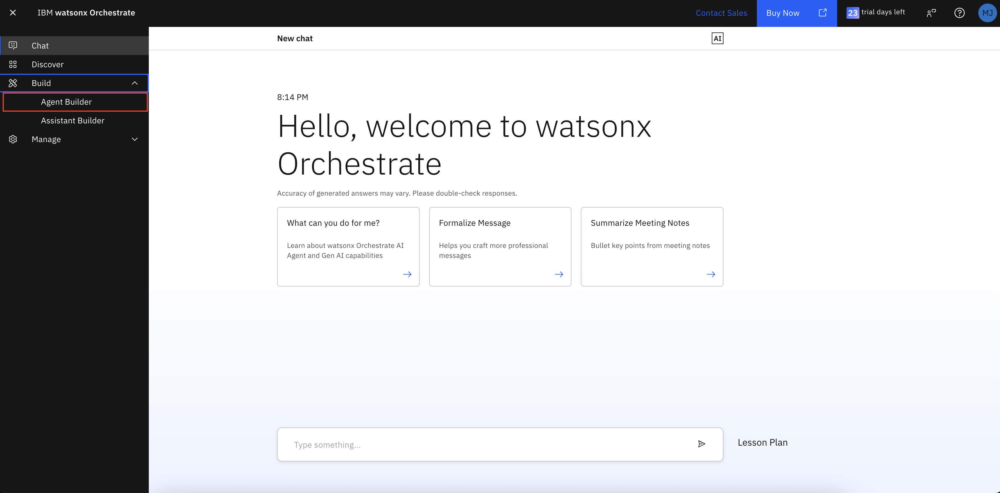

2. Click on the **Create Agent** button.
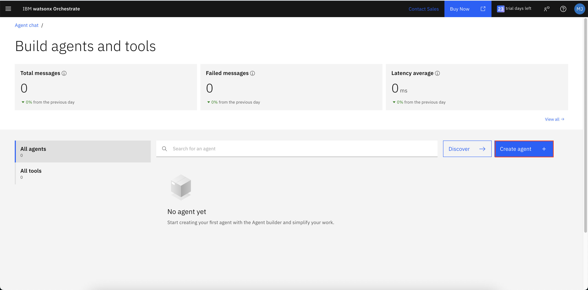

3. Select **Create from scratch** (#1 on image below)
   
   **Name** (#2 on image below):
   ```
   Product Agent
   ```
   **Description** (#3 on image below):
        
   ```
   This agent is designed to search for a specified product and retrieve its details and features using Retrieval-Augmented Generation (RAG) on the product catalog. It presents the information in a clear and structured format, ensuring systematic organization of key product data, making it easy to understand and use.
   ```

   Click on **Create** button

   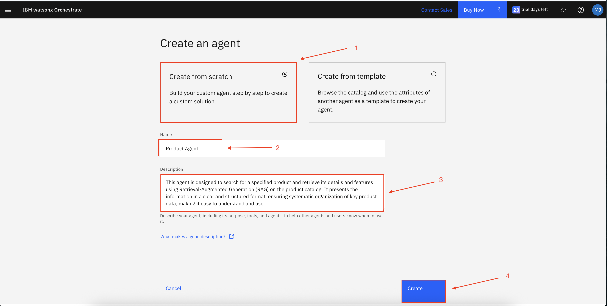

4. Once the agent is created, go to the **Agent Configuration** page and set the model to `llama-3-405b-instruct` and the Agent style to Default.
   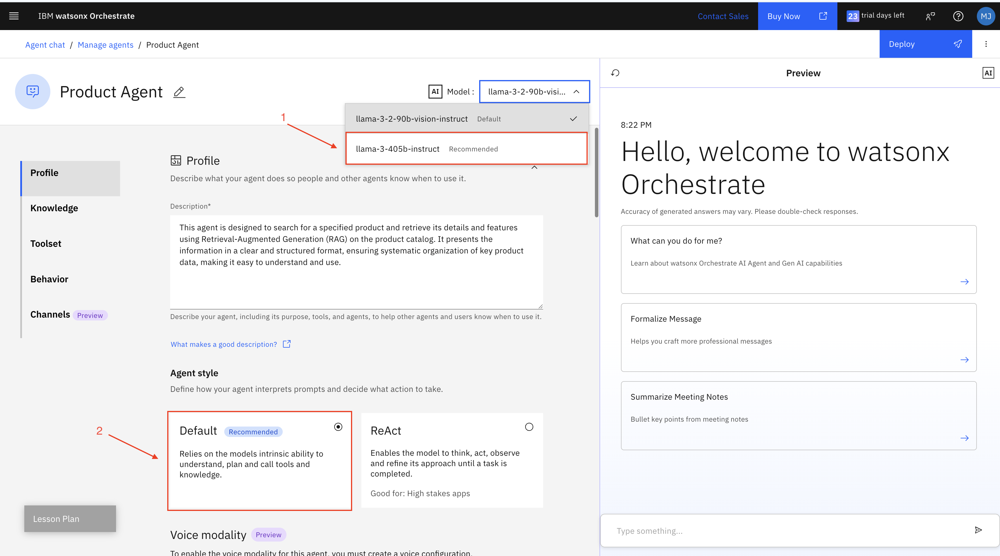

5. Scroll down to the **Knowledge** section and click on the **Choose knowledge** button.
   

6. After clicking the **Choose knowledge** button, a pop-up window will appear. Select **Upload Files**, then click **Next**.
   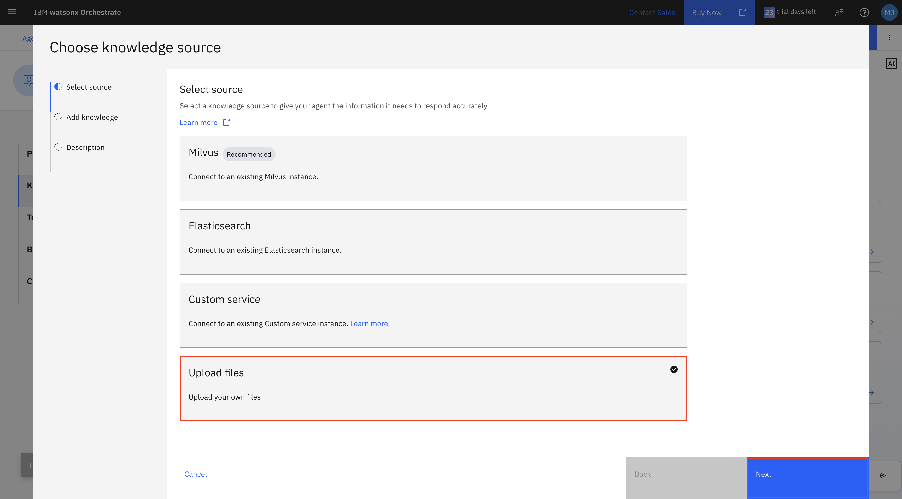

7. Next, choose the knowledge source. In our case, it's the [Product Catalog](./assets/ABC_Motor_Product_Catalog.pdf). Drag and drop the file into the designated area.
   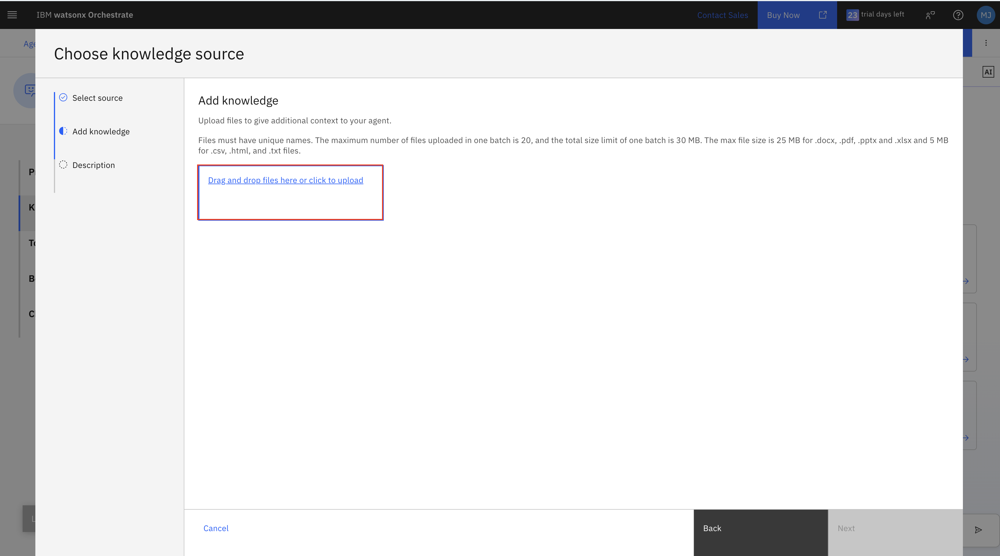

8. Once the file is uploaded, the screen will look like the one below. Click **Next** to proceed.
  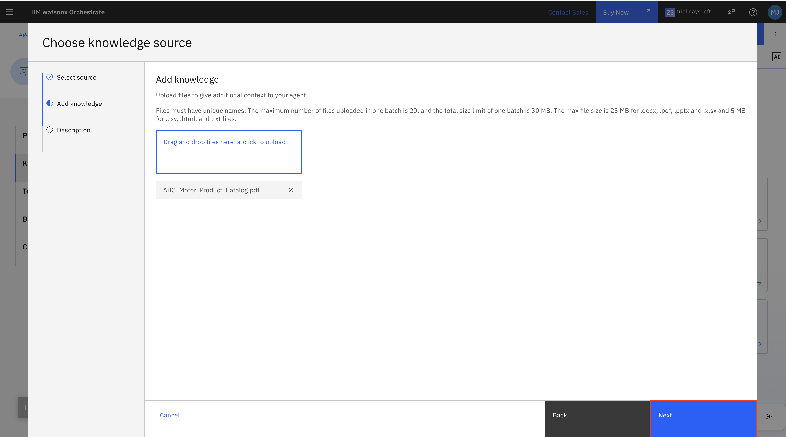

9. Add the description below in the **Description** field, and then click **Save**.
   **Description:**
   ```
   Your knowledge base is the document that contains all the product-related information. All queries related to the product will be addressed using this document as the primary source.
   ```
   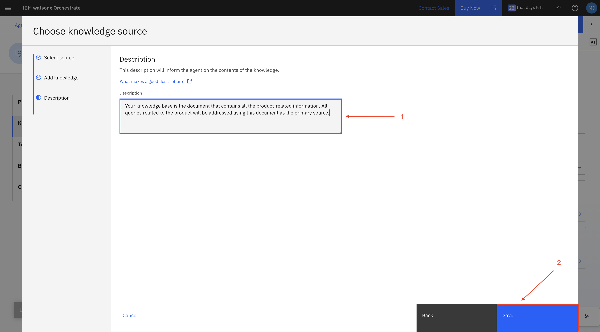

10. After completing all the above steps, your knowledge source will be added and will appear as shown in the image below.
   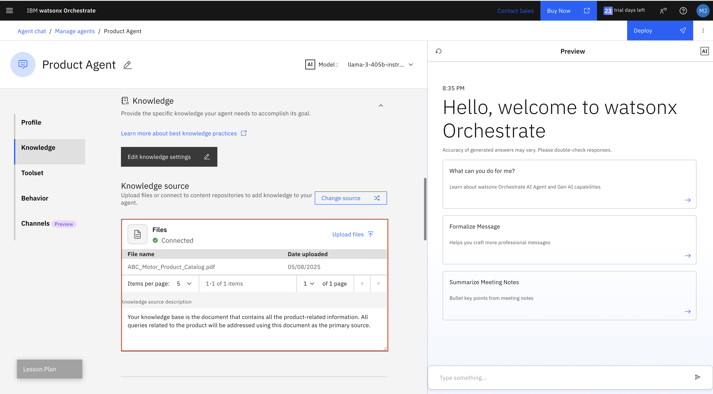

11. Scroll down to the **Toolset** section, then in the **Agents** section click on the **Add Agent** button.
   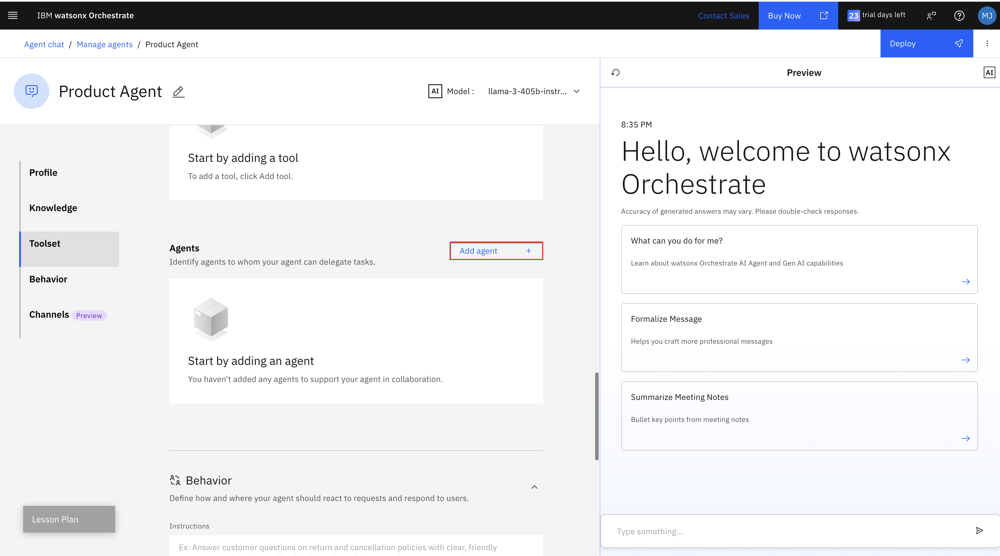

12. From the pop-up menu, select the **Import**.
   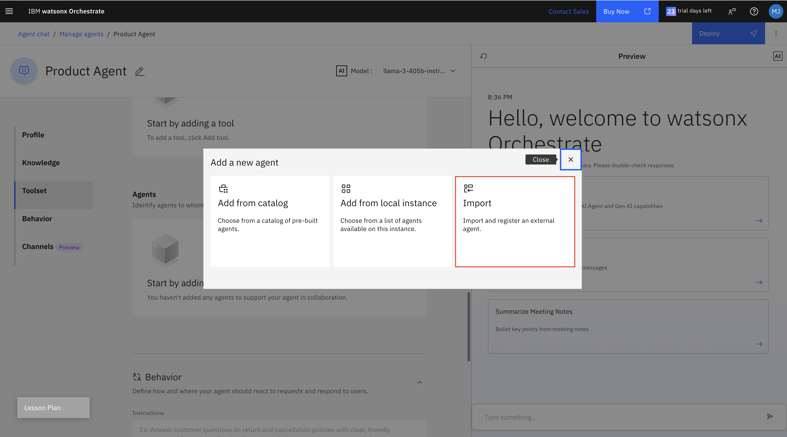

> **Note:** : We are now adding the Comparison Agent (an external agent) to the Product Agent, enabling it to delegate tasks to them.

13. On the next page, ensure that **External Agent** is selected (see #1 on image below). If it’s not already selected, please choose it, then click the **Next** button (see #2 on image below).
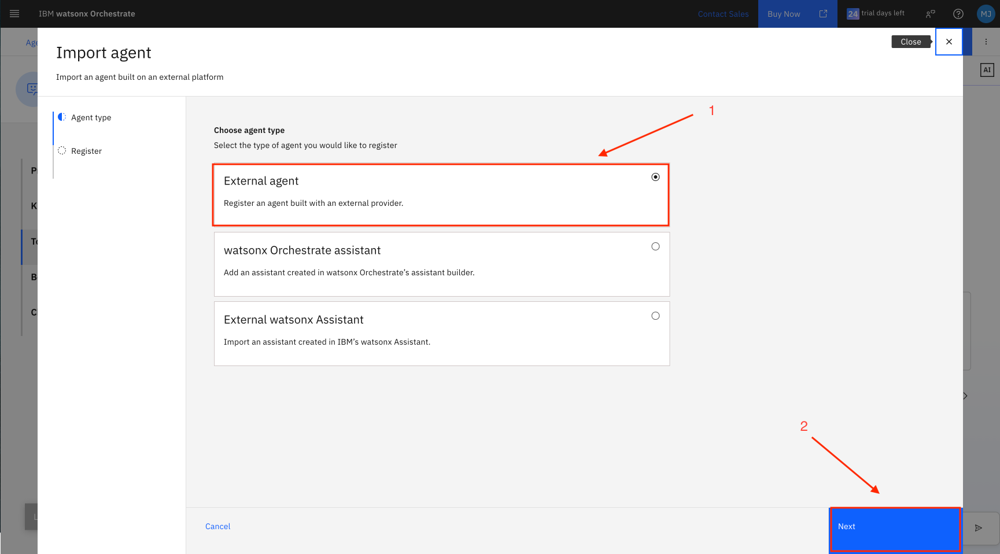

14. On the next page, enter the following information:
    1. **Provider**: From the drop down select **watsonx.ai**. 
       >NOTE: If this isn't set, you will encounter the following error: `Authentication request failed because the expected Bearer token is missing from the request header`
    2. **API key**: Enter your IBM Cloud API key.
    3. **Service instance URL**: Enter the public streaming endpoint URL of the agent that we copied in [step 6 above](#integrating-watsonxais-agent-as-an-external-agent-in-watsonx-orchestrate).
    4. **Display name**: `Comparison-Agent-v1`
    5. **Description of agent capabilities**: 
       ```
       This agent is designed to search for competitive URLs of input product and compare the given compare the given data with additional information gathered from Google search results. Its task is to carefully analyze the input data, extract key insights, and identify both differences and similarities. The findings should be presented in a well-structured table format, making it easy to understand and compare the information at a glance.
       ```
    6. Click on the **Import Agent** button.

    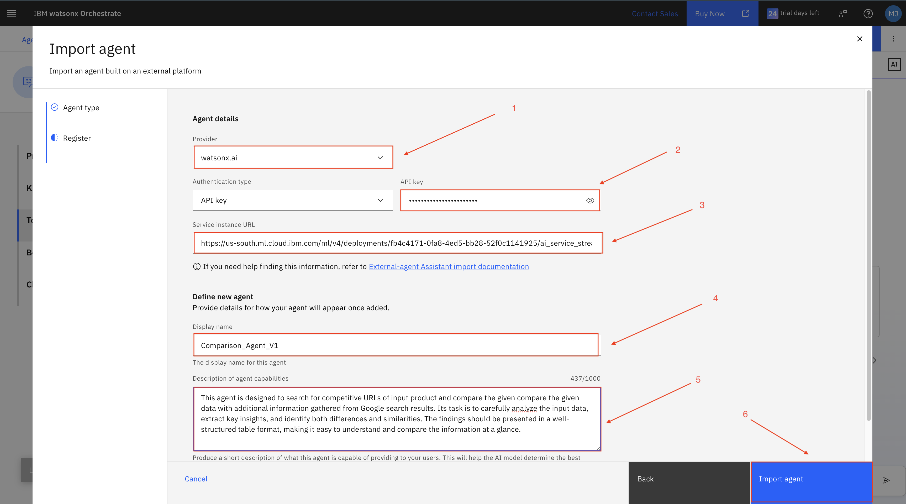

15. Once the delegated agents are added, they will appear as shown in the image below.
    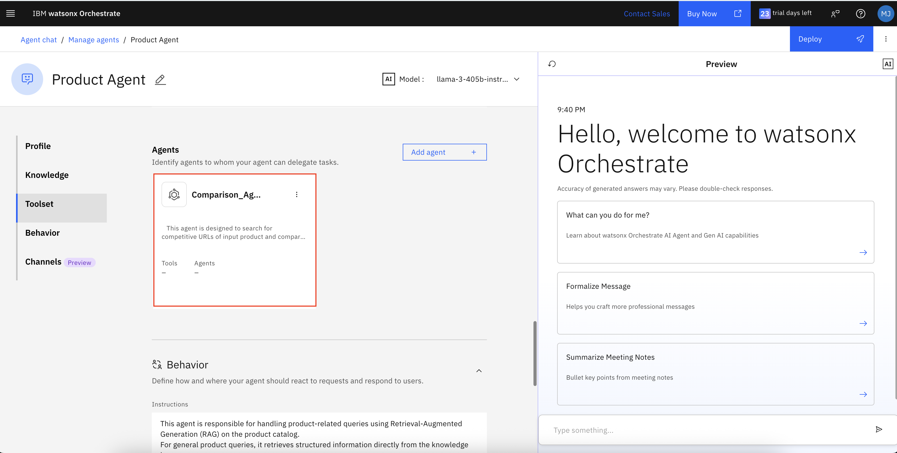

16. Scroll down to the **Behavior** section, add the following for **Description**:

    ```
    This agent is responsible for handling product-related queries using Retrieval-Augmented Generation (RAG) on the product catalog.
    For general product queries, it retrieves structured information directly from the knowledge base.
    For queries involving URLs or web references or comparison, it delegates the task to the Comparison Agent.
    ```

    Click the **Deploy** button:
    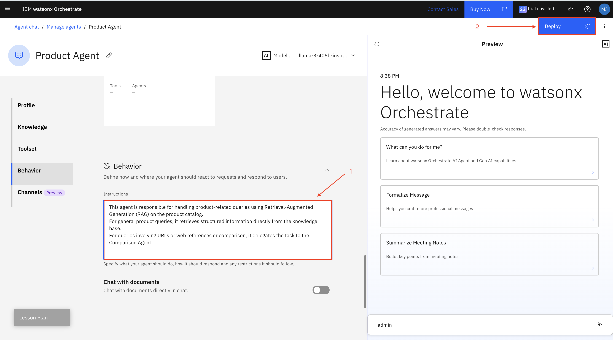

> **Note:** : The Product Agent is now ready to handle product-related queries, delegating tasks to the **Comparison Agent** as needed.

## Experience Agents in Action
Follow the steps above, then try interacting with the use case using these sample queries:

1. Go to the hamburger menu and select **Chat**
   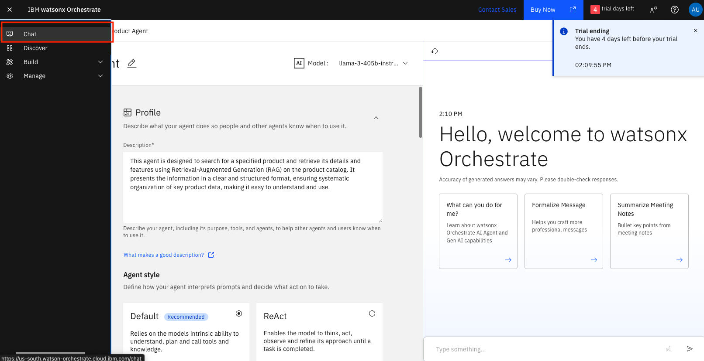
  

1. Select the **Product Agent** from the dropdown menu, and you should be good to go.
   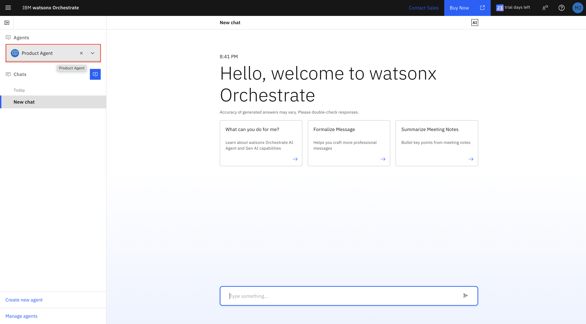

1. Product Agent

   Ask the following queries which should be routed to the Product Agent:
   ```
   What are the products of ABC Motors.
   ```
   ```
   Give me the info of Zenith X3.
   ```
   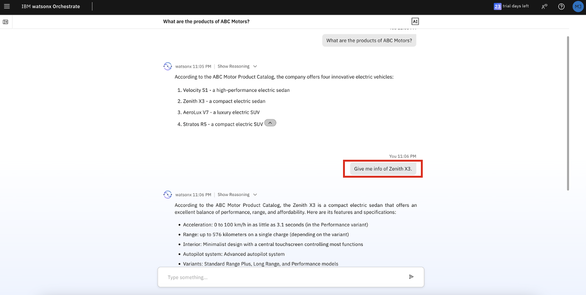  

3. Comparison Agent

   To compare the retrieved data, ask:
   ```
   Give me URLs of the competitors of the above product and show me the comparison as well.
   ```
     
   


