# Use case: Business Automation   

## Table of Contents

- [Description of the use case](#description-of-the-use-case)
- [Architecture](#architecture)
- [AI Agents](#ai-agents)
- [Hands-on Lab Guide](#hands-on-lab-guide)
  - [Access your environment](#access-your-environment)
  - [Create an AI agent on watsonx.ai](#1-create-an-ai-agent-on-watsonxai)
  - [Import the Comparison Agent to IBM watsonx Orchestrate](#2-import-the-comparison-agent-to-ibm-watsonx-orchestrate)
  - [Create the Product Agent](#3-create-the-product-agent)
  - [Test your AI Agents](#4-test-your-ai-agents)
- [Conclusion](#conclusion)


## **Description of the use case**

The sales department of ABC Motor Corp., a major player in the automotive industry, spends a lot of time understanding the features of competitive products and comparing them with their own when preparing sales proposals.

ABC Motor Corp. is requesting you to create an automated competitive analysis system to help their sales teams quickly identify and position their products against competitors.

Traditionally, gathering competitor insights requires extensive manual research, making the process inefficient and prone to outdated information. Therefore, the goal of this use case is to create an AI-enabled system that supports the customer's competitive analysis and market research.

## **Architecture**  


## **AI Agents**

During this Agentic AI workshop, you will create **2 AI agents**, each of them with a specific purpose:

| Agent Name        | Platform             | Purpose                                                                 |
|-------------------|----------------------|-------------------------------------------------------------------------|
| Product Agent     | watsonx Orchestrate  | Answers product-level questions and performs RAG on the product catalog |
| Comparison Agent  | watsonx.ai  | Searches competitor links, compares product features, gives ratings, and performs SWOT analysis    |

---

###
# **Hands-on Lab Guide**
###

## **Access your environment**

Access your environment (URL provided by your instructor) and enter the workshop password provided by your instructor. 

<div align="center">
   
</div>

To access IBM Cloud, click on the IBM Cloud Login.

<div align="center">
   
</div>


## **1. Create an AI agent on watsonx.ai** 

To access **watsonx.ai**, follow these steps:

1.	If not already logged into your IBM Cloud account, navigate your preferred browser to **https://cloud.ibm.com** and log in with your credentials (use your IBMid username and password).

2.	On your IBM Cloud landing page, click the top left navigation menu (hamburger menu) and select Resource list.

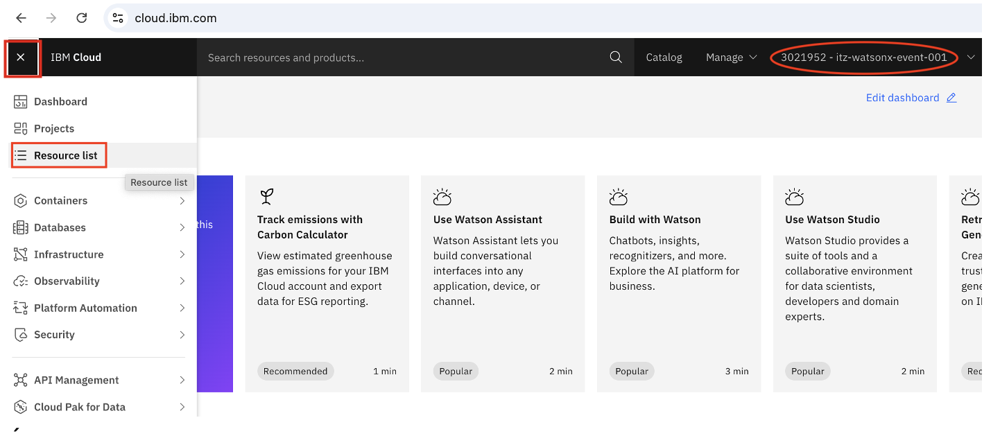


   > **Note**: If you are a member of multiple IBM Cloud accounts, make sure you are working in the correct account which has the required services available as explained in the environment-setup guide.

3.	On the Resource List page, expand the AI / Machine Learning section, and click the watsonx AI service name. Make sure you select the **watsonx.ai Runtime** service (product column).

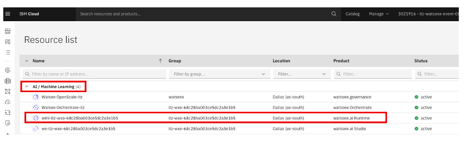

4.	Click **Launch in > IBM watsonx** to launch the service.

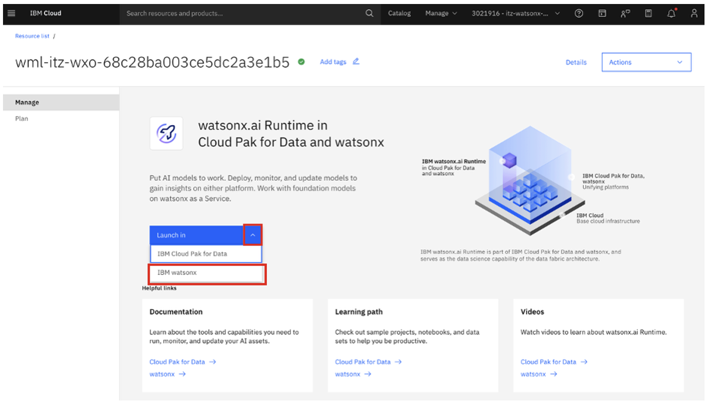

### **1.1 Create a project inside watsonx.ai**

1.	From the Homepage of **watsonx.ai**, click on the hamburger menu > select **Projects** and then **View all projects**.
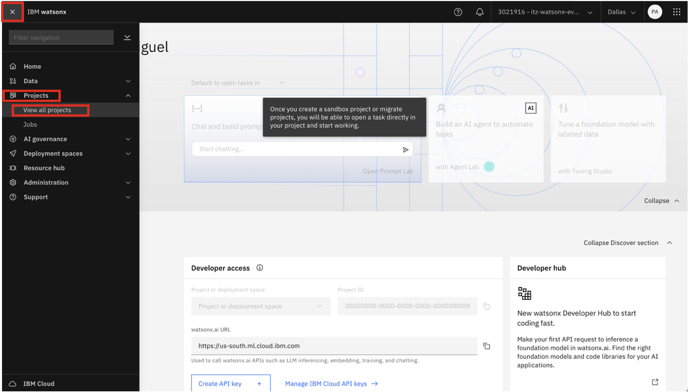

2.	Here, you will **create a new project**. This project will be where you will work. In production, you should have a project for each use case.
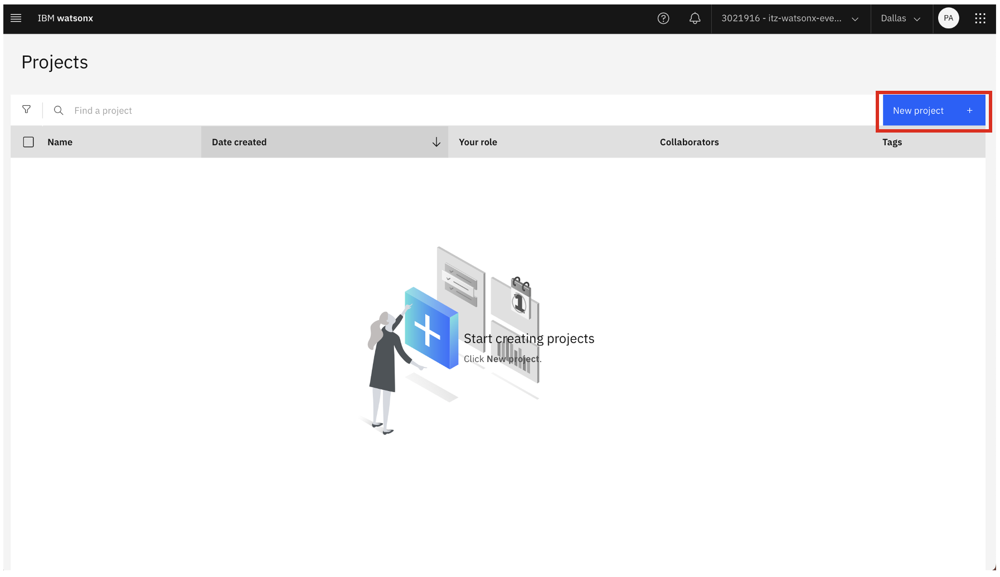

3.	Give it a **Name**, **Description**, select a **storage** and click **Create**.
      - **Name**:
         ```
         Agentic AI Bootcamp
         ```
      - **Description**: 
         ```
         Agentic AI Bootcamp
         ```
      - **Storage**: 
         ```
         Select the one available to you
         ```
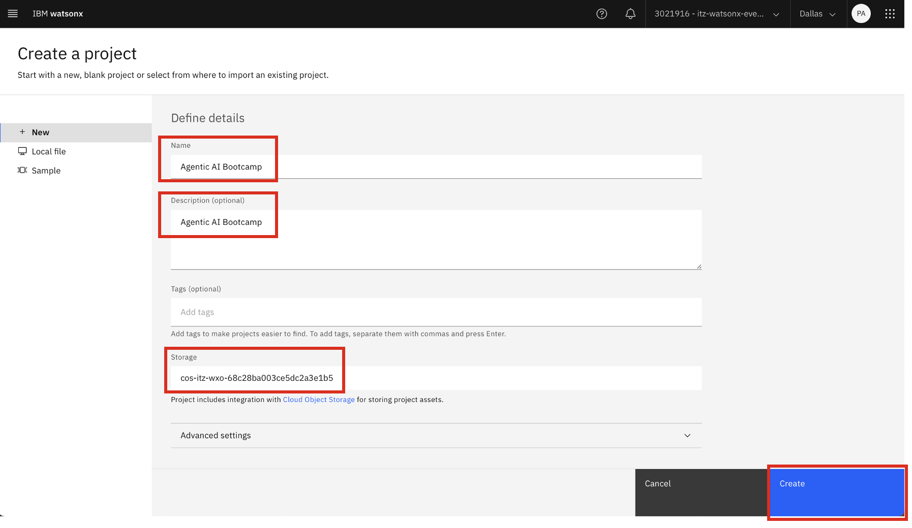

4.	Once your project is created you should see it's homepage.
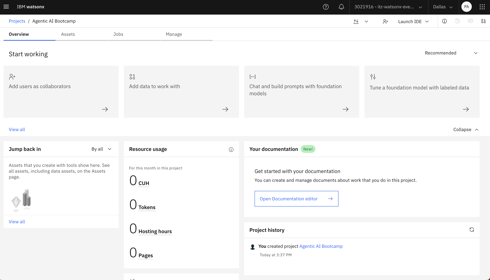

5.	Click on **Manage** and then **Services & integrations**.
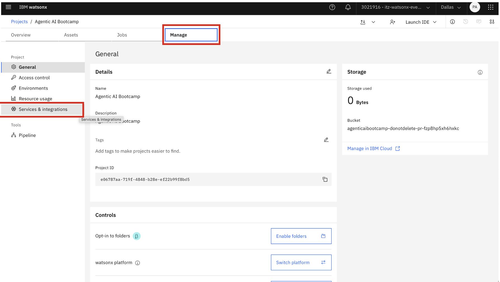

6.	Here, you will **associate a new service**. This service will give you access to all necessary watsonx.ai features you will need to complete this hands-on exercise.
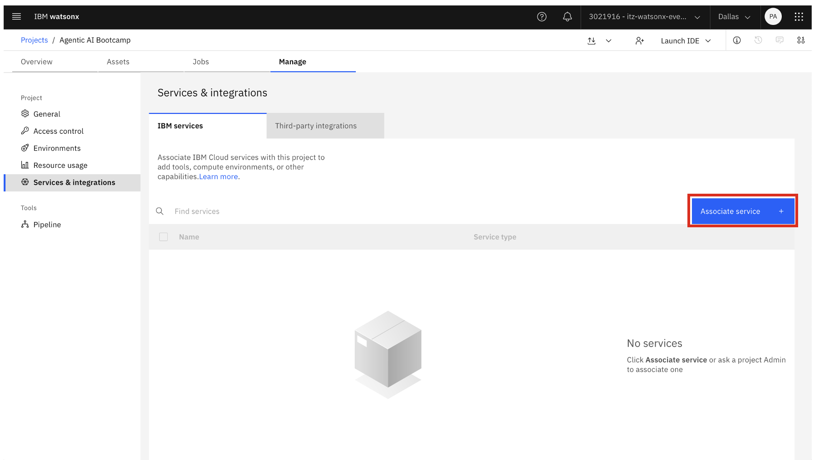

7.	Select the available service - it must be the **watsonx.ai Runtime** - and then click **Associate**.
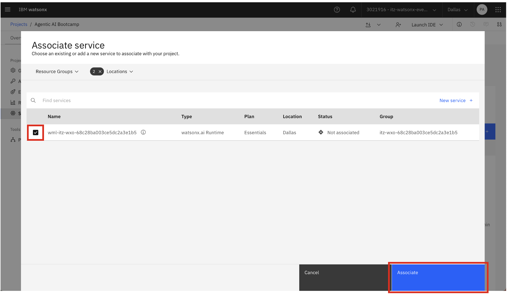

      > **Note:** If the service is not listed, clear all the filters applied to the Resource Groups and Locations.


### **1.2 Create a deployment space inside watsonx.ai**

1.	From the Homepage of **watsonx.ai**, click on the hamburger menu > select **Deployment spaces** and then **View all deployment spaces**.
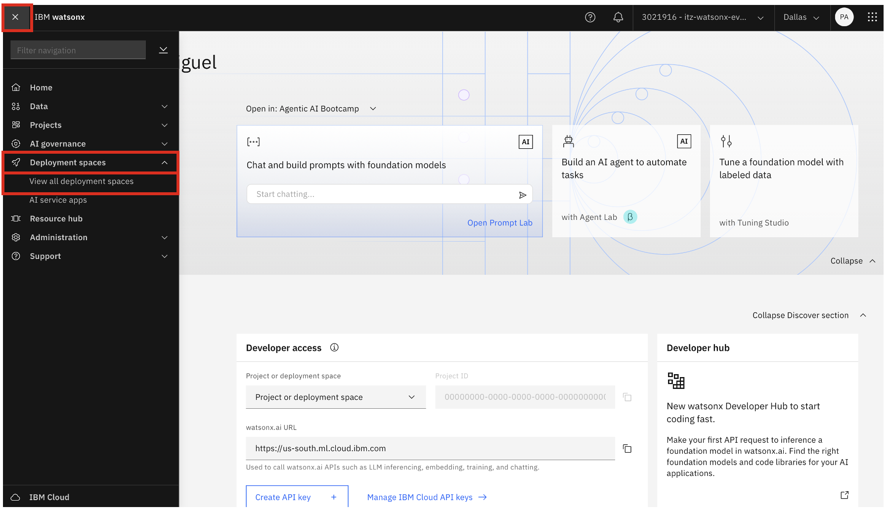

2.	Here, you will **create a new deployment space**. You can use deployment spaces to deploy various assets and manage your deployments.
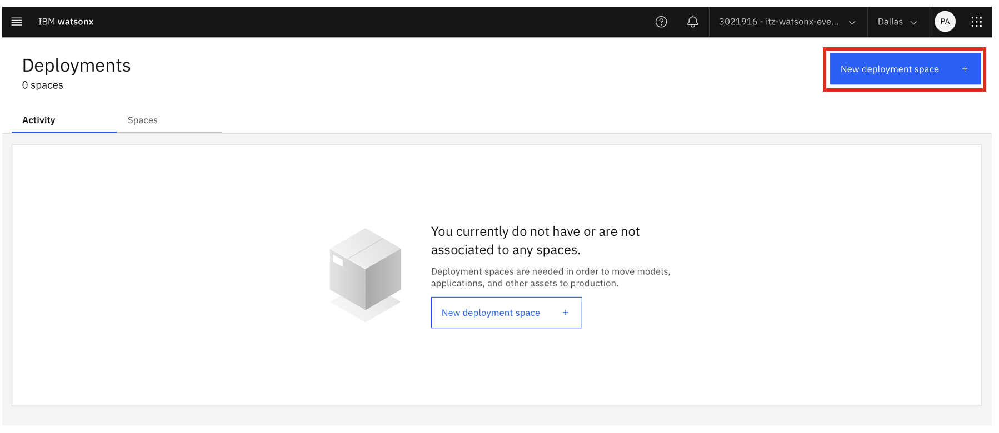

   > **Note:** For more details, please consult the [Deployment Spaces](https://www.ibm.com/docs/en/watsonx/w-and-w/2.2.0?topic=assets-deployment-spaces) documentation.


2.	Give it a **Name**, **Description**, select a **Deployment stage**, **storage** and the **watsonx.ai Runtime service** you associated earlier and click **Create**.
      - **Name**:
         ```
         Agentic AI Bootcamp Deployment Space
         ```
      - **Description**: 
         ```
         Agentic AI Bootcamp Deployment Space
         ```
      - **Deployment Stage**: 
         ```
         Testing
         ```
      - **Storage**: 
         ```
         Select the one available to you
         ```
      - **watsonx.ai Runtime**: 
         ```
         Select the one available to you
         ```
      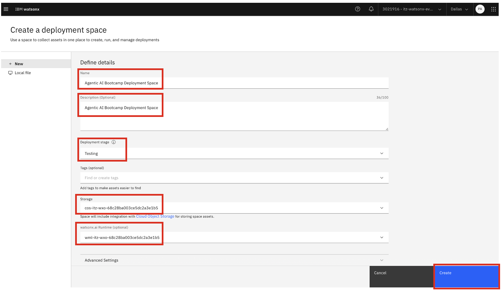

      > **Note:** The deployment space can take a couple of minutes do deploy and be ready for access.

3.	Once the deployment space is ready, you will see a similar message:
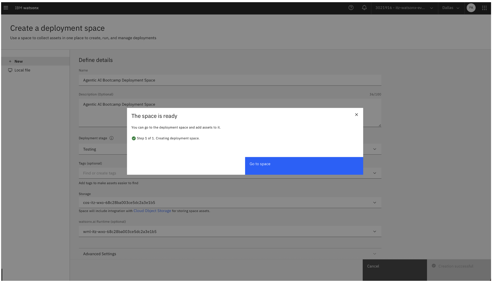


### **1.3 Create the Comparison Agent** 

We will now create the **Comparison Agent** using **watsonx.ai's Agent Lab** feature.

   > **Note:** For more details, please consult the [Agent Lab](https://www.ibm.com/docs/en/watsonx/saas?topic=agents-agent-lab-beta) documentation.

1. From the Homepage of **watsonx.ai**, click on **View All**.

<div align="center">
   
</div>

2. Select "Build an AI agent to automate tasks", as shown in the image below.

<div align="center">
   
</div>


Let's start to design and deploy the **Comparison Agent**!


#### **1. Setup**  
1. **Name**:
   ```
   Comparison Agent
   ```
2. **Description**: 
   ```
   The agent compares the given data with additional information gathered from Google search results.
   ```
  

#### **2. Configuration**    
1. **Framework**:
   ```
   LangGraph
   ```
2. **Architecture**:
   ```
   ReAct
   ```
3. Enter the following for **Instructions**. These instructions guide your agent on what tasks it should perform:
   ```
   You are an expert of automobile industry combining given details present in your context window.  Your task is crawl and search the Top 3 product URLs (strictly from the automobile industry) and to analyse and compare products on the following features strictly: Range, Pricing, Acceleration, Top Speed, Interior and Safety Features If a feature is not applicable, mark it as N/A. Additionally, perform a SWOT analysis of top products (Strengths, Weaknesses, Opportunities, and Threats) Present the comparison in 3 tables one for the comparison , second for the rating numerical rating (X/5) and a star rating (★ out of ★★★★★) for each feature  and  third for the SWOT analysis. Give heading to each table . After every table give two divider.
   Instructions:
   1. When asked for competitors of the given product, make sure that you provide only the name of the products and URLs of the products below the corresponding name.
   2. The generated product URLs must be strictly from the automobile industry.
   3. Title for Table 1: Feature Comparison
   4. Title for Table 2: Rating Comparison
   5. Make sure that the Rating Comparison table has both the numerical(X/5) and star rating(★ out of ★★★★★)
   6. The products should be the column names in all the tables.
   7. The font of the Table Title must be bold and the font size must be 40% bigger as compared to the rest of the text.
   8. Add appropriate space between each section in the table.
   9. Name the References as Competitors
   ```
  


• **Architecture**: The Architecture section consists of the description of the agent which you provided as part of creating the agent. You can always go to this section to edit and refine the description of the agent as needed. In this section, you also specify the Agent style whether Default or ReAct.

> **Note:** For more details, please consult the [Choosing a reasoning style for your agent](https://www.ibm.com/docs/en/watsonx/watson-orchestrate/base?topic=agents-choosing-style-agent) documentation.

• **Instructions**: The Instructions section of the agent configuration is where you provide instructions to the agent to define how it responds to user requests and situations. You can configure rules that dictate when and how the agent should take action. These rules help the agent behave in a predictable and consistent manner, delivering a seamless user experience.

> **Note:** For more details, please consult the [Adding instructions to agents](https://www.ibm.com/docs/en/watsonx/watson-orchestrate/current?topic=agents-adding-instructions) documentation.


#### **3. Tools**  

1. Click on the **Add Tool**.


2. Select **Google Search** as the tool to gather data.  
  

• **Tools**: Tools are how you enable agents to act. Agents can accomplish tasks by using Tools or can delegate tasks to other Agents which are deeply skilled in such tasks.

> **Note:** For more details, please consult the [documentation](https://www.ibm.com/docs/en/watsonx/watson-orchestrate/base?topic=building-tools).


#### **4. Save and Deploy**

1. Click on the Disk icon, then to **Save As**
 
2. Select **Agent** and click **Save**

3. Click on the **Deploy** button
4. On the **Deploy as an AI service** page, you will be prompted to create a user api key. This will be used by **watsonx** to deploy your agent and is different from the **Cloud API key** created earlier. Click on **Create**. 

5. You'll be directed to another webpage. Click on **Create a key**.

6. Once a key is created, navigate back to **Deploy as an AI service** page. Click on **Reload**.

7. Make sure your **Targeted deployment space** (created previously when **watsonx** project was created) has been selected, click **Deploy** to deploy the agent


> **YOU DID IT! you just created and deployed your first AI Agent.**
> Now let's build more agents and integrate them together.


## **2. Import the Comparison Agent to IBM watsonx Orchestrate**

To deploy your agent on Orchestrate, follow the steps below: 

1. Go to the homepage of watsonx.ai.


2.	From the Homepage of **watsonx.ai**, click on the hamburger menu > select **Deployment spaces** and then **View all deployment spaces**.


3. Click on the **Spaces** tab and select the space where you deployed the agent.  


4. Click on the **Assets** tab and select the agent.  


   > **Note:** If the agent does not show, go back to your Project > Assets > Select the Comparison Agent > Edit > Deploy again on your deployment space

5. Then you will go the main deployment page select your agent from the list.


6. Then copy the streaming **Public endpoint**. Save this information, because you will need it later.


Now, let's start to design and deploy our Orchestrator agent, the **Product Agent**, on **watsonx Orchestrate**.

## **3. Create the Product Agent** 

To access **watsonx Orchestrate**, follow these steps:

1.	If not already logged into your IBM Cloud account, navigate your preferred browser to **https://cloud.ibm.com** and log in with your credentials (use your IBMid username and password).

      > **Note**: If you are a member of multiple IBM Cloud accounts, make sure you are working in the correct account which has the required services available as explained in the environment-setup guide.

2.	On your IBM Cloud landing page, click **Manage** on the top and select **Access IAM**.

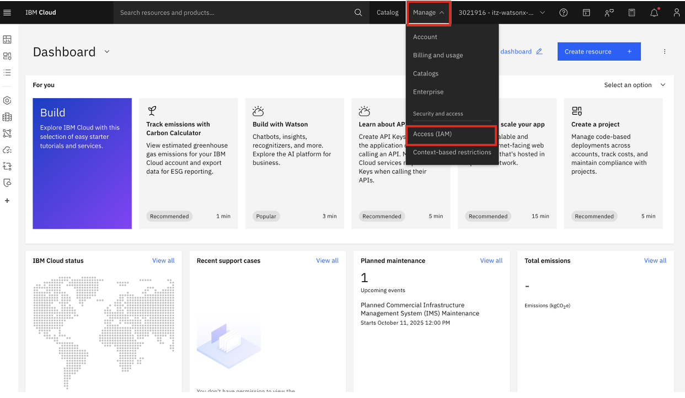

3.	On the left, select **API keys** and **create** a new one.

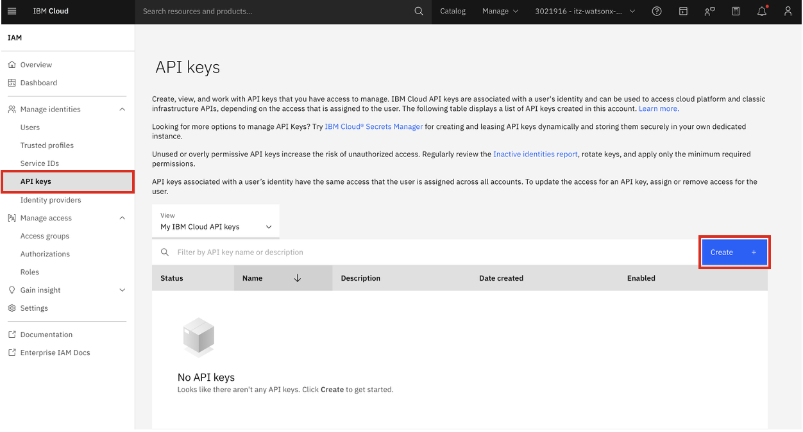


4.	Give it a **Name**, **Description** and click **Create**.

    **Name**:
      ```
      Agentic AI Bootcamp API Key
       ```
    **Description**: 
      ```
      Agentic AI Bootcamp API Key
      ```
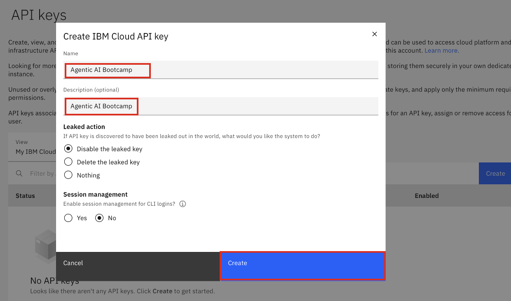

5. **Copy** this information, because you will need it later.


6.	Go back On your IBM Cloud landing page, click the top left navigation menu (hamburger menu) and select Resource list.


7.	On the Resource List page, expand the AI / Machine Learning section, and click the **watsonx Orchestrate** service name.


8.	Click Launch **watsonx Orchestrate** to launch the service.

 

9. Once **watsonx Orchestrate** service is launched, you would be at its landing page as illustrated in the figure below.

   > **Note**: When you start with a new service instance, there will be no custom agents defined and thus, the section under Agents will state No agents available.


10. Go to the **watsonx Orchestrate** homepage, click on the hamburger menu (☰), select **Build**, and then choose **Agent Builder**.
 

11.	Note the analytics captured at the top of the page including **Total messages**, **Failed messages**, and **Latency average**.
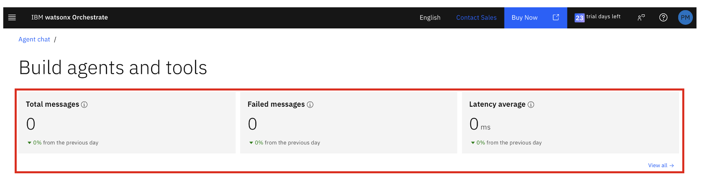 

12. Click on the **Create Agent** button to start building your first agent.


13. Select **Create from scratch**
   
   **Name**:
   ```
   Product Agent
   ```
   **Description**:
        
   ```
   This agent is designed to search for a specified product and retrieve its details and features using Retrieval-Augmented Generation (RAG) on the product catalog. It presents the information in a clear and structured format, ensuring systematic organization of key product data, making it easy to understand and use.
   ```

The natural language description of an agent is important as it is leveraged by the agentic solution to route user messages to the right agent skilled in addressing the request. For more details, please review the [Understanding the description attribute for AI Agent](https://www.ibm.com/docs/en/watsonx/watson-orchestrate/base?topic=agents-recommendations-agent-descriptions) documentation.

**watsonx Orchestrate** supports creating an agent from scratch or from a template which involves browsing a catalog of existing agents and using attributes of another agent as a template for the new agent. For this lab, you will be creating agents from scratch.

> **Note:** To discover all the pre-built agents and tools in **watsonx Orchestrate**, please consult the [catalog of pre-built agents and tools](https://www.ibm.com/docs/en/watsonx/watson-orchestrate/base?topic=discovering-catalog) documentation.

14. Click on **Create** button

   


After the AI Agent is created, in this section, you will go through the process of configuring the agent with knowledge and tools to enable it to respond to queries using information from the knowledge base and perform tasks using the tools.

Next, you will go through the process of configuring your agent. The Product Agent page is split in two halves:
- The right half is a preview chat interface that allows you to test the behavior of your agent.
- The left half of the page consits of five key sections that you can use to configure your agent.

   - **Profile**: The Profile section consists of the description of the agent which you provided as part of creating the agent. You can always go to this section to edit and refine the description of the agent as needed. In this section, you also specify the Agent style whether Default or ReAct.

      > **Note:** For more details, Please consult the [Choosing a reasoning style for your agent](https://www.ibm.com/docs/en/watsonx/watson-orchestrate/base?topic=agents-choosing-reasoning-style-your-agent) documentation to understand the difference and how it affects the agent's behavior.

   - **Knowledge**: The Knowledge section is where you can add knowledge to the agent. Adding knowledge to agents plays a crucial role in enhancing their conversational capabilities by providing them with the necessary information to generate accurate and contextually relevant responses for specific use cases. You can directly upload files to the agent or connect to a Milvus or Elasticsearch instance as a content repository. Through this Knowledge interface, you can enable your AI agents to implement the Retrieval Augmented Generation (RAG) pattern which is a very popular AI pattern for grounding responses to a trusted source of data such as enterprise knowledge base.

      > **Note:** For more details, please consult the [Adding knowledge to agents](https://www.ibm.com/docs/en/watsonx/watson-orchestrate/current?topic=agents-adding-knowledge) documentation.

   - **Toolset**: While Knowledge is how you empower agents with a trusted knowledge base, then Toolset is how you enable agents to act by providing them with Tools and Agents. Agents can accomplish tasks by using Tools or can delegate tasks to other Agents which are deeply skilled in such tasks.

      - For Tools, you can use the [**watsonx Orchestrate Agentic Development Kit (ADK)**](https://developer.watson-orchestrate.ibm.com/) to develop and upload Python and OpenAPI tools to a specific **watsonx Orchestrate** instance which you can then add to the agents.

      - Additionally, **watsonx Orchestrate** also supports the addition of [Model Context Protocol (MCP)](https://developer.watson-orchestrate.ibm.com/mcp_server/wxOmcp_overview) tools. MCP is a standard for connecting AI Agents to systems where data lives including content repositories, business tools and development environments. MCP is becoming increasingly popular as the standard for enabling agents with tools.

      > **Note:** For more details, please consult the [Adding tools to an agent](https://www.ibm.com/docs/en/watsonx/watson-orchestrate/base?topic=building-tools) and [Adding agents for orchestration](https://www.ibm.com/docs/en/watsonx/watson-orchestrate/current?topic=agents-adding-orchestration) sections of the documentation.

   - **Behavior**: The Behavior section of the agent configuration is where you provide instructions to the agent to define how it responds to user requests and situations. You can configure rules that dictate when and how the agent should take action. These rules help the agent behave in a predictable and consistent manner, delivering a seamless user experience.

      > **Note:** For more details, please consult the [Adding instructions to agents](https://www.ibm.com/docs/en/watsonx/watson-orchestrate/current?topic=agents-adding-instructions) documentation.

   - **Channels**: The Channels section is how you expose your agent to different communication platforms (for example, Slack). This integration improves user experience and agent accessibility. At this time of this lab writing, channel support is in Preview with support for WebChat, Microsoft Teams, and WhatsApp with Twilio. The product will be adding support for additional channels where you can deploy your agent(s).

      > **Note:** For more details, please consult the [Connecting to channels](https://www.ibm.com/docs/en/watsonx/watson-orchestrate/base?topic=agents-connecting-channels) documentation.

15. Once the agent is created, go to the **Agent Configuration** page and set the model to `llama-3-405b-instruct` and the Agent style to Default.
   

16. Scroll down to the **Knowledge** section and click on the **Choose knowledge** button.
   

17. After clicking the **Choose knowledge** button, a pop-up window will appear. Select **Upload Files**, then click **Next**.
   

18. Next, choose the knowledge source. In our case, it's the Product Catalog (ABC_Motor_Product_Catalog.pdf located in the Box folder provided by the instructor).
   

19. Once the file is uploaded, the screen will look like the one below. Click **Next** to proceed.
  

20. Add the description below in the **Description** field, and then click **Save**.
      ```
      Your knowledge base is the document that contains all the product-related information. All queries related to the product will be addressed using this document as the primary source.
      ```
   

21. After completing all the above steps, your knowledge source will be added and will appear as shown in the image below.
   

22. Scroll down to the **Toolset** section, then in the **Agents** section click on the **Add Agent** button.
   

23. From the pop-up menu, select the **Import**.
   

      > **Note**: You are now adding a new connection between the Product Agent and the Comparison Agent (external agent created on watsonx.ai). This connection will allow the Product Agent to delegate tasks to the Comparison Agent.

24. On the next page, ensure that **External Agent** is selected. If it’s not already selected, please choose it, then click the **Next** button.


25. On the next page, enter the following information:
    1. **Provider**: From the drop down select **watsonx.ai**. 
       >**Note**: If you select other option, during your tests, you will encounter the following error: `Authentication request failed because the expected Bearer token is missing from the request header.`
    
    2. **API key**:
         ```
         Enter your IBM Cloud API key - the one you created on the **3. Create the Product Agent - Step 5** section.
         ```

    3. **Service instance URL**:
         ```
         Enter the agent public streaming endpoint URL - the one you created on the **2. Import the Comparison Agent to IBM watsonx Orchestrate - Step 6** section.
         ```

    4. **Display name**:
         ```
         Comparison Agent
         ```
    
    5. **Description of agent capabilities**: 
       ```
       This agent is designed to search for competitive URLs of input product and compare the given compare the given data with additional information gathered from Google search results. Its task is to carefully analyze the input data, extract key insights, and identify both differences and similarities. The findings should be presented in a well-structured table format, making it easy to understand and compare the information at a glance.
       ```
    
    6. Click on the **Import Agent** button.

    

26. Once the delegated agents are added, they will appear as shown in the image below.
    

27. Scroll down to the **Behavior** section, add the following for **Description**:

    ```
    This agent is responsible for handling product-related queries using Retrieval-Augmented Generation (RAG) on the product catalog.
    For general product queries, it retrieves structured information directly from the knowledge base.
    For queries involving URLs or web references or comparison, it delegates the task to the Comparison Agent.
    ```

28. Click on the **Deploy** button:
    
    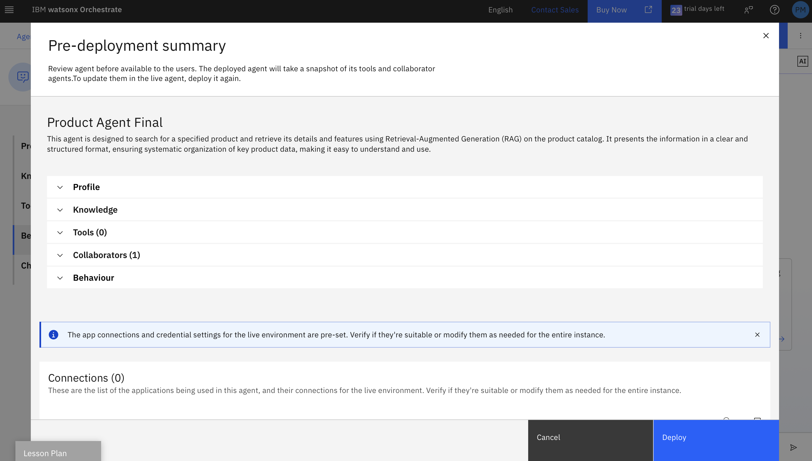


   The Product Agent is now ready to handle product-related queries and delegates tasks to the **Comparison Agent** if needed.

   > **Note**: It can take a couple of minutes to deploy the agent.

## 4. Test your AI Agents

1. Go to the hamburger menu and select **Chat**.
   
  

1. Select the **Product Agent** from the dropdown menu and you are good to go!
   

1. Start typing your questions.
   -  **Question #1**:
   ```
   What are the products of ABC Motors?
   ```
   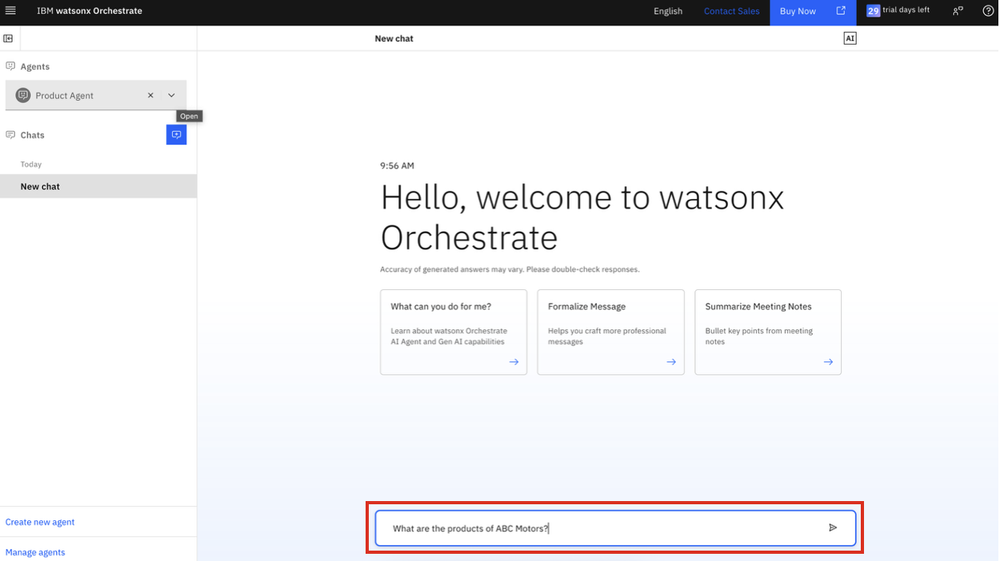

     -  **Question #2**:
      ```
      Give me more information about Zenith X3.
      ```
     

   To understand how the agent was able to retrieve the answer, click on **Show reasoning**.

   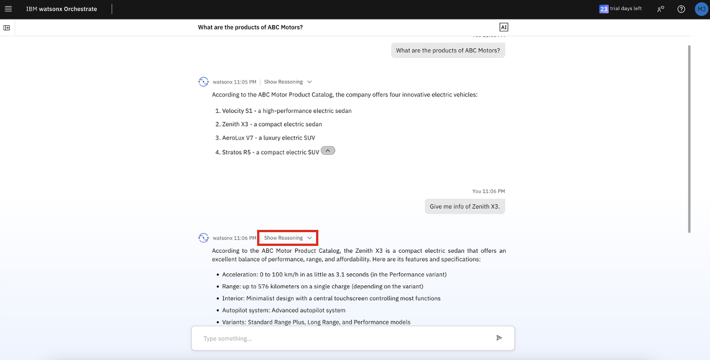

   • **Reasoning**: AI agent reasoning is the process by which an artificial intelligence system makes decisions to achieve a specific goal. An AI agent typically follows a cycle: it understands the environment, processes that information to understand the current situation, decides what action to take, acts on that decision and then updates its knowledge based on what happened.

   AI agents don’t always act alone. They can also interact with other agents and tools to solve more complex tasks. For instance, an AI agent might call on a weather service (a tool) to check the forecast, or coordinate with another AI agent that handles scheduling.

   In these examples, reasoning includes deciding which tools or agents to use, when, and how to communicate with them.

    - **Question #3**:
   ```
   Give me URLs of the competitors of the above product and show me the comparison as well.
   ```
     
   

   - **Question #4**:
   ```
   How does BMW X5 compare to its main competitors? show me the comparison
   ```
   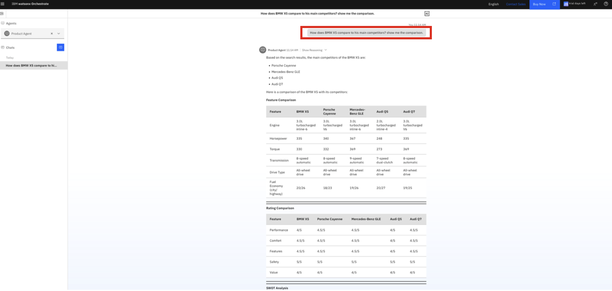
   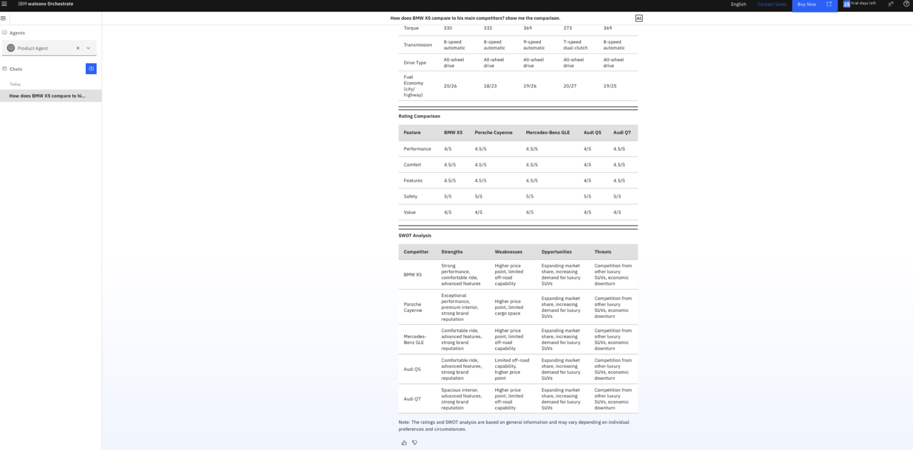

   To understand how the agent was able to retrieve the answer, click on **Show reasoning**.

   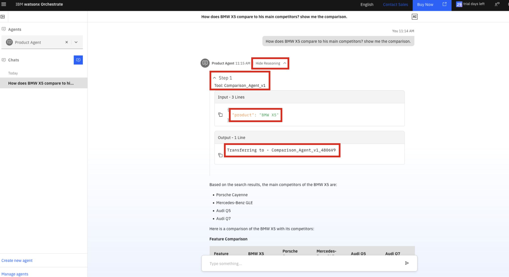


As you can see, depending on the input (user request/question), **Product Agent (Orchestrator agent)** is responsible for understanding the user's intent and redirecting the task or tasks to the most appropriate AI agent or tool.

In the examples above:
- If the user's question is about ABC Motor products (Velocity S1, Zenith X3, etc.), the **Product Agent (Orchestrator Agent)** leverages its tool to connect to the knowledge base — in this case, a single file, but it could also be a database, lakehouse, etc...

- If the **Product Agent (Orchestrator Agent)** can't find the necessary information in the knowledge base — for example, to perform a comparison between products — it connects to the **Comparison Agent**, who leverages the Google Search tool to retrieve information from the internet.

   - The **Comparison Agent** sends the Google Search results to the **Product Agent (Orchestrator Agent)**, who uses the foundational model you’ve chosen — llama-3-405b-instruct — to compile the information and generate an answer.


# Congratulations 🎉 You’ve reached the end of the workshop! 

## Conclusion

This lab provided a hands-on, structured approach to building and testing AI agents in the business automation domain, using a realistic enterprise dataset.

Participants from this workshop walk away with:
- Practical experience using IBM solutions: **watsonx.ai** and **watsonx Orchestrate**
- Practical knowledge of **RAG pipelines**
- Experience **creating and deploying AI agents** to automate business enterprise workflows
